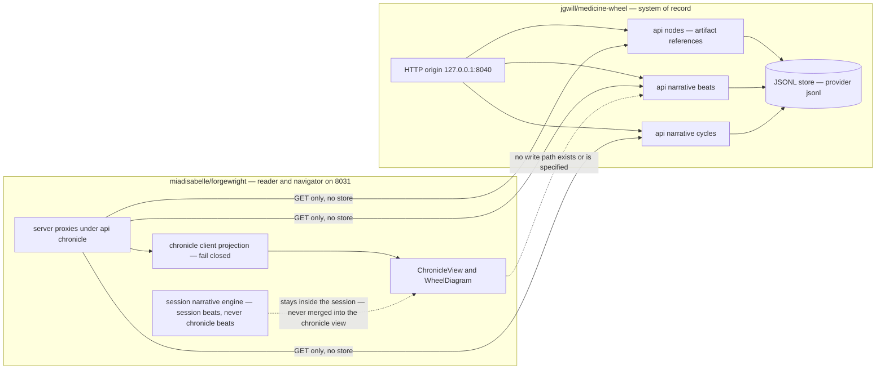
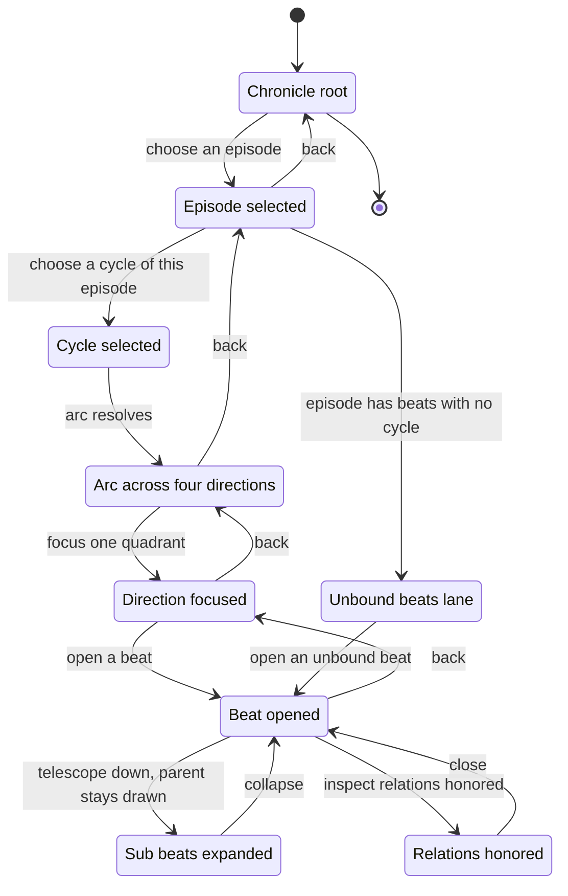
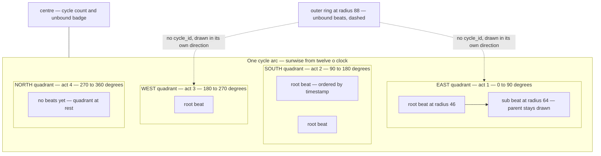
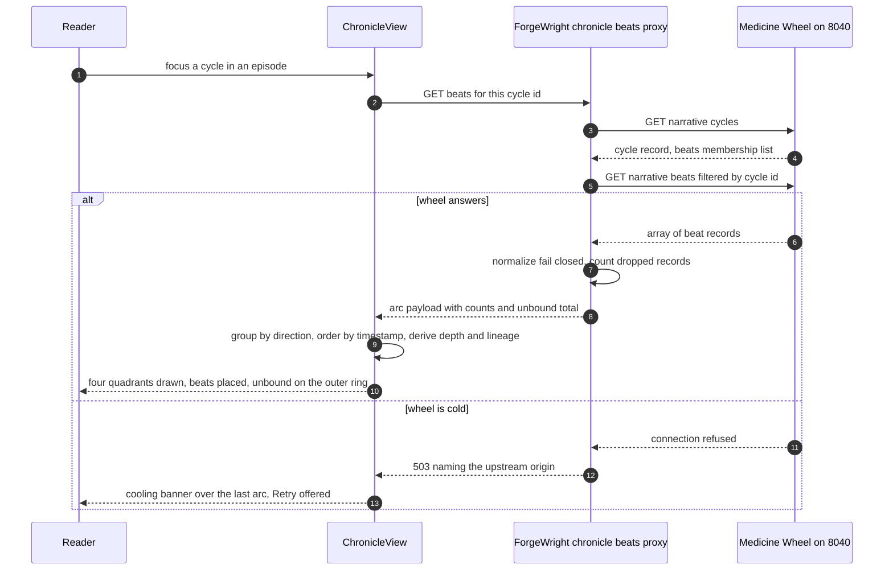

# 11 — Chronicle Narrative Beats

> An episode carries plans, inquiries, and perspectives. It also carries **beats** — the moments where the work actually turned. Medicine Wheel holds them as ontological record; ForgeWright's work is to let a reader walk them: episode → cycle → arc → direction → beat → sub-beats → the relations that beat honored, and back out again, with every beat drawn where it belongs on the wheel.

**Version**: 0.1.0
**Framework**: RISE v1.2
**Date**: 2026-07-24
**Working tree**: `10-smcraft-runtime-integration` at `dae8e64`, two commits ahead of `main` at `339c2d1`
**Kin**: `08-medicine-wheel-integration.spec.md`, `09-inquiry-weave-visibility.spec.md`, `10-plan-perspective-visibility.spec.md`

---

## Context

*Reverse engineering — what is actually here, verified in this turn.*

### The two repositories and the direction data travels

ForgeWright runs on host `ilex`, reachable locally at `http://localhost:8031`. Medicine Wheel runs at `http://127.0.0.1:8040` (ssh tunnel to the same host), app `@medicine-wheel/app` v0.5.1, storage provider `jsonl`.



### What ForgeWright reads today

`src/lib/chronicle/client.ts` resolves one origin from `MW_API_URL` (default `http://127.0.0.1:8040`, set by `dae8e64`) and holds it server-side. Three read paths exist, each with a server proxy so the browser never learns the origin:

| Surface | Proxy | Upstream | Projection |
|---|---|---|---|
| Artifact references | `src/app/api/chronicle/route.ts` | `/api/health` + `/api/nodes` | `ChronicleArtifactReference` under contract `miadi.artifact-ref.v1` |
| Inquiry weaves | `src/app/api/chronicle/inquiry/route.ts` | `/api/inquiry-weaves` | `InquiryRelation` (spec 09) |
| Plan perspectives | `src/app/api/chronicle/perspectives/route.ts` | `/api/plan-perspectives` | `PlanPerspective` (spec 10) |

The discipline these three share is the acceptance surface this spec extends:

- **Fail-closed normalization** — a record that misses a required field is dropped from the rendering collection and counted, never half-rendered.
- **Failure is never shaped like success** — an unreachable upstream returns 503 from the proxy with `describeChronicleSource()` naming *which* wheel failed; it never becomes an empty array.
- **Heat vocabulary** — `useMwHealth` gives `ember` (wheel answers), `cooling` (a failed refresh over a kept snapshot), `cold` (nothing to show). `ChronicleView` keeps the last snapshot on a failed refresh rather than blanking.
- **Shared in-view cache** — `src/lib/chronicle/viewCache.ts` fetches once per resource per view and projects per card; every nested section moves through `loading | error | empty | ready`, and `empty` renders silence while `error` renders its own Retry.

### What the wheel is actually serving

Verified against the live origin:

- `GET /api/nodes` → 18 nodes: 10 `chronicle_episode`, 3 `structured_plan`, 1 `chronicle_root`, plus `product_goal` and `consumer_interface` nodes that fail the artifact contract and land in `ignoredNodeCount`.
- `GET /api/narrative/beats` → `[]` — a **bare JSON array**, not an envelope.
- `GET /api/narrative/cycles` → `[]` — likewise bare.

So the beat surface exists, answers, and is empty. Nothing on the live wheel has a beat yet.

### The upstream shape, and where it is not yet whole

`NarrativeBeat` in `src/ontology-core/src/types.ts` (lines 211–240 of `jgwill/medicine-wheel`) carries `id`, `direction`, `title`, `description`, `prose?`, `ceremonies[]`, `learnings[]`, `timestamp`, `act`, `relations_honored[]`, plus the newer `cycle_id?`, `parent_beat_id?`, `sub_beats?[]`, and `origin?: { producer, source_ref?, method? }`. `MedicineWheelCycle` carries `id`, `research_question`, `start_date`, `current_direction`, `beats[]`, `ceremonies_conducted`, `relations_mapped`, `wilson_alignment`, `ocap_compliant`.

`@medicine-wheel/narrative-engine` v0.5.1 exports beat authoring and lineage as pure functions — `createBeat`, `createBeats`, `telescopeBeat`, `attachBeatToCycle`, `beatsInCycle`, `orphanBeats`, `beatLineage`, `beatDepth`, `rootBeats`, `childBeats`, `actForDirection`/`ACT_FOR_DIRECTION` — alongside `sequenceBeats`, `validateCadence`, `validateArc`, `buildTimeline`, `computeProgress`.

Two of the three conditions that bounded this spec while it was drafted **have since been resolved upstream**, in `jgwill/medicine-wheel` commits `9b2494e` and `e0e7c2c` on `main`. They are recorded here rather than deleted, because the ask ForgeWright makes of the wheel is easier to judge when the reader can see what the wheel just changed:

| Was | Now | Commit |
|---|---|---|
| The HTTP write path dropped `cycle_id`, `parent_beat_id`, `sub_beats`, `origin`, so **no beat created over HTTP could belong to a cycle** | `app/api/narrative/beats/route.ts` passes all four through, plus the caller's `id` and `timestamp`; `lib/store.createBeat` binds both sides of the cycle relation | `9b2494e` |
| `get_narrative_arc` filtered `allBeats` by `b.direction` alone, so every cycle reported the same arc | Reads membership through `beatsInCycle`, honouring both `beat.cycle_id` and `cycle.beats` | `9b2494e` |
| `POST /api/narrative/beats` discarded the caller's `id`, so a writer could not find back the beat it had just created | The supplied `id` is honoured | `9b2494e` |
| `act` defaulted to `1` regardless of direction | Derived from direction via `actForDirection` | `e0e7c2c` |

**Not yet resolved, and still binding on this spec:**

1. **There are no filters on the HTTP beat surface.** `GET /api/narrative/beats` returns everything; there is no `?cycle_id=`, `?direction=`, or `?episode_path=`. ForgeWright must therefore filter client-side, which is the first Exportation ask below.
2. **The deployed wheel and the deployed forge both lag their sources.** The fixes above are on `main` and not yet on the device serving `:8040`. Until they ship, a beat written through the running wheel still cannot join a cycle — so this spec's navigation is buildable against `main` and not against the live instance.

### The episodes on disk

Chronicle episodes live under `/srv/miadi/episodes/miadi-chronicle/`. Their contents are heterogeneous by design: `2026-07-18-episode-138-medicine-wheel-ui-enhancements/` holds only `episode.yaml` (whose `references[]` names `jgwill/medicine-wheel#96` through `#101`); `2026-06-25-episode-093-medicine-wheel-adequate-display/` holds only a `.claude/` directory and no `episode.yaml` at all; `2026-06-19-episode-068-extending-medicine-wheel-for-relational-film-production/` holds session notes, prompts, a relational map, a source ledger, audio, and a nested follow-up vessel. Medicine Wheel registers a **reference** to the episode — kind and `relative_path` — never the content. ForgeWright therefore never reads episode files; it reads the wheel's projection of them.

### ForgeWright's own beat machinery — the boundary risk

`src/lib/narrative/` is a working narrative engine inside ForgeWright: `arc-manager.ts` (`createArc`, `addBeat`, `validateArcCoherence`, `getArcCompleteness`), `beat-generator.ts`, `wilson-score.ts`, `chronicle.ts` (renders a four-direction session chronicle in Markdown), and `storage.ts` (JSONL under `.coaia/beats/` and `.coaia/arcs/`). `src/lib/session/lifecycle.ts` calls `createArc`/`addBeat` and holds arcs in an in-memory `Map` keyed by session id. `src/lib/types/narrative.ts` declares ForgeWright's own `NarrativeBeatSchema` and `MedicineWheelCycleSchema` — Zod shapes that resemble the upstream types but are not them.

Verified: nothing outside `src/lib/narrative/` calls `storeBeat`, `loadBeats`, or `exportArc`. The local beats live and die inside a session.

This is the structural risk this spec exists to name. **ForgeWright already has an apparatus capable of authoring beats.** Left unbounded, its session beats and the wheel's chronicle beats would mingle in one view and a reader would have no way to tell which ones the circle actually witnessed.

### Deployed drift, stated as observed fact

The deployed instance answers:

```json
{"status":"healthy","service":"forgewright","version":"0.1.0",
 "capabilities":{"chronicle":"read-only","structuredPlans":"read-only",
                 "stateMachines":"deferred","mcpHttp":"deferred"},
 "dependencies":{"medicineWheel":{"service":"medicine-wheel","baseUrl":"http://127.0.0.1:8040",
                 "status":"healthy","provider":"jsonl"}},
 "counts":{"episodes":10,"structuredPlans":3,"stateMachines":0}}
```

`src/app/api/health/route.ts` in the working tree returns `stateMachines: 'read-only'` — set by commit `35b03b7` on `7-ui-polish-cycle`, which is an ancestor of `main`. The deployed build still answers `deferred`. **The running build is behind `main`.** A capability string is a promise to a reader; a promise that only exists in source is not yet made.

---

## Desired State

*Intent — what this spec advances toward.*

A reader opens the Chronicle, chooses an episode, and follows its narrative to the exact turn where the work moved: the cycle that held it, the arc across four directions, the direction that carries the beat, the beat itself with the ceremonies and learnings it recorded, the sub-beats it was telescoped into, and the relations it honored — then walks back out. Every beat is drawn where it belongs on the wheel, and no beat is ever hidden for being unbound.

**The boundary this rests on, stated once and enforced everywhere:**

**Medicine Wheel is the system of record for beats, cycles, ceremonies, and relations. ForgeWright is the reader and navigator. ForgeWright does not become a second writer of ontological truth.**

| Concern | Owner | Why |
|---|---|---|
| Beat identity, direction, act, title, description, prose, ceremonies, learnings, relations honored, timestamp | Medicine Wheel | The record of what the circle witnessed |
| `cycle_id`, `parent_beat_id`, `sub_beats`, `origin` | Medicine Wheel | Membership and provenance are relational facts, not view decisions |
| Cycle identity, research question, current direction, membership, Wilson alignment, OCAP compliance | Medicine Wheel | A cycle is a ceremony, not a folder |
| **Selection** — which episode, cycle, direction, beat is focused | ForgeWright | Where the reader is standing |
| **Navigation** — route state, back-out order, deep links | ForgeWright | How the reader moves |
| **Cache** — one fetch per resource per view, reload generations, retry | ForgeWright | How often the wheel is asked |
| **Presentation** — quadrant geometry, placement angle, radius by depth, colour, truncation, expand and collapse | ForgeWright | How the record is drawn |
| **Pure derivation** — grouping by direction, ordering within a quadrant, depth, lineage, orphan detection, progress | ForgeWright | Re-derivable from the record at every render; it adds no new truth |

The rule that separates the last row from the first: **anything ForgeWright derives must be recomputable from what the wheel served, and must never be persisted anywhere another reader would mistake for record.** A derived act, a derived grouping, a derived orphan flag — all fine, and all gone on refresh. A written beat — never.

**ForgeWright's own session beats are a different genus.** `src/lib/narrative/` produces *session beats*: in-memory, session-scoped, generated by `src/lib/session/lifecycle.ts` for the session chronicle. They are not chronicle beats, they never appear in the Chronicle view alongside wheel beats, and they never travel to `/api/narrative/beats`. If a session beat should ever become part of the record, it goes through Medicine Wheel's own write surface, carrying `origin.producer` that says so — and that registration is **not in this spec's scope**.

**Non-goals:** no write path, no beat authoring UI, no MCP client wiring beyond naming the surface, no reading of episode content files, no migration of the local session engine.

---

## Structural Tension

**Current Reality**: The wheel serves a beat surface that answers and is all but empty. The fields that make a beat navigable — `cycle_id`, `parent_beat_id`, `sub_beats`, `origin` — are declared in the ontology and, as of `jgwill/medicine-wheel@9b2494e`, now survive the write path on `main`; the instance serving `:8040` has not yet received that build, so nothing it serves today carries them. ForgeWright renders episodes, plans, weaves, and perspectives through a proven read-only discipline, has a four-direction `WheelDiagram` drawing quadrants with no beats on them, holds a local beat engine whose output has no declared boundary against the record, and runs a deployed build whose capability strings lag its source.

**Desired State**: A reader walks an episode's narrative to a single beat and back, sees every beat placed on the wheel by its own direction and its own depth, sees unbound beats surfaced rather than hidden, and can tell from the record itself whether a beat was authored by hand, derived by a processor, or witnessed from an event stream. ForgeWright reads all of it and writes none of it.

**Natural progression**: The tension resolves in the direction it already flows. The read discipline of specs 09 and 10 generalizes to beats without invention — same proxy shape, same fail-closed projection, same shared cache, same silence-for-empty. The `WheelDiagram` already fixes the quadrant geometry that placement needs. `@medicine-wheel/narrative-engine` v0.5.1 already exports the pure lineage functions that derivation needs. What must move upstream — round-trip fidelity, membership filtering, membership-scoped arcs — is small, named, and belongs to the repository that owns the record. Each step below moves one of those pieces and leaves the others intact.

---

## Specifications

### 11.1 — Position in the relation

ForgeWright ships **no** write client for `/api/narrative/*`. There is no POST, PATCH, or DELETE method in any chronicle module, and no code path that constructs a beat destined for the wheel.

`src/lib/types/narrative.ts` remains ForgeWright's **session** shape and is never used to validate wheel records. Wheel records are validated by a distinct projection (11.5) so that a schema drift upstream surfaces as dropped records with a count, not as silent coercion into a local shape.

The Chronicle view renders wheel beats only. Session beats stay in the session surfaces. No view merges them.

### 11.2 — Chronicle navigation over narrative beats

**Today** there is no URL: `src/app/page.tsx` renders `AppShell`, which holds `activeView` in React state across three tabs (`state-machine | graph | chronicle`) declared in `Toolbar.tsx`. No file in `src/` uses `useSearchParams`, `useRouter`, or `history.replaceState`. Nothing in the Chronicle can be linked to or restored.

**Navigation model** — a strict containment ladder, each level a refinement of the one above:



**Route shape.** The shell keeps its single page; navigation becomes deep-linkable query state on that page:

```
/?view=chronicle
 &episode=<episode relative path>
 &cycle=<cycle id>
 &direction=<east|south|west|north>
 &beat=<beat id>
```

Rules:

- A parameter is meaningful only with its ancestors present. `beat` without `direction` resolves the direction from the beat's own `direction` field and rewrites the URL to the canonical full ladder.
- **Back-out removes the deepest parameter**, so browser back and the in-view back affordance agree.
- An unresolvable parameter degrades to its nearest resolvable ancestor and renders an explicit `could not resolve <param>` note. It never renders a blank view and never silently drops to the root.
- `view=chronicle` is what makes the Chronicle tab restorable; the other tabs gain the same parameter for free.

**Lifecycle states** — the four already in `viewCache.ts`, applied per level:

| Level | loading | error | empty | ready |
|---|---|---|---|---|
| Episode card beat section | `SectionLoading` label `Narrative beats` | `SectionError` + Retry, message names the upstream | **silence** — count 0 renders nothing | count badge + cycle list |
| Cycle arc | skeleton wheel with quadrants at rest | `SectionError` + Retry over the kept arc | **explicit** — four quadrants at rest with `no beats recorded in this cycle yet` | beats placed |
| Beat detail | inline pulse | inline error + Retry | not reachable — a beat that resolved has content | full record |

The asymmetry is deliberate: silence under an episode means *nothing registered*; a chosen cycle is an explicit act of navigation, so silence there would read as breakage and the arc says so in words instead.

**Legacy records with no `cycle_id`.** A beat without `cycle_id` is an **unbound beat**. It is surfaced, never hidden:

- It appears in an `Unbound beats` lane at the arc level, with its own count.
- On the wheel it is drawn on the outer ring beyond the quadrant radius, dashed, in the quadrant its `direction` names.
- ForgeWright **never infers** a `cycle_id` for it — not from timestamp proximity, not from episode co-location, not from direction. Inference here would manufacture membership, which is record, not view.
- Grouping by direction still works, because `direction` is required on every beat.

**Cycles with no beats.** A cycle whose `beats` array is missing or empty is a valid legacy record with zero members (kin: `jgwill/medicine-wheel#83`). The projection treats absent `beats` as `[]` and renders the arc-empty state. It never throws and never drops the cycle.

**Freshness.** Beats join the existing `Refresh` action and `reloadKey` generation, with `cache: 'no-store'`. No new polling. A failed refresh leaves the last arc drawn and moves the banner to `cooling`.

### 11.3 — Placing a beat on the wheel

`src/components/medicine-wheel/WheelDiagram.tsx` already fixes the geometry, sunwise from twelve o'clock on a 200×200 viewBox centred at `100,100` with radius `90`:

| Direction | Act | Arc, clockwise from twelve o'clock | Existing path |
|---|---|---|---|
| East | 1 | 0–90 degrees | `M 100 100 L 100 10 A 90 90 0 0 1 190 100 Z` |
| South | 2 | 90–180 degrees | `M 100 100 L 190 100 A 90 90 0 0 1 100 190 Z` |
| West | 3 | 180–270 degrees | `M 100 100 L 100 190 A 90 90 0 0 1 10 100 Z` |
| North | 4 | 270–360 degrees | `M 100 100 L 10 100 A 90 90 0 0 1 100 10 Z` |

The centre circle already carries the cycle count. Beat placement extends this diagram; it does not replace it.

**Quadrant is decided by `direction`, never by `act`.** `act` is the sunwise ordinal and must agree — `ACT_FOR_DIRECTION` in `@medicine-wheel/narrative-engine` is the authority. A beat whose `act` contradicts its `direction` renders in its **direction's** quadrant and carries a discrepancy marker; placement never resolves a contradiction by silently trusting one field.

**Angle within a quadrant.** Beats in a quadrant are ordered by `timestamp` ascending. For the k-th of n beats, zero-indexed:

```
theta = 90 * (act - 1)  +  90 * (k + 1) / (n + 1)     // degrees, clockwise from twelve o'clock
x = 100 + r * sin(theta)
y = 100 - r * cos(theta)
```

The `(k+1)/(n+1)` spacing keeps beats off the quadrant seams, so a beat never sits ambiguously between two directions.

**Radius by telescoping depth.** `beatDepth` from the narrative engine gives depth from the root beat:

```
r = 46 + 18 * depth        // depth 0 → 46, depth 1 → 64, depth 2 → 82
```

Depth beyond 2 collapses into a `+N deeper` affordance on the deepest drawn mark rather than crowding the rim.

**Telescoped sub-beats never replace their parent.** When a beat is telescoped, the parent stays drawn at its own radius and a connector joins it to each child in the same angular band. Selecting any beat highlights its whole `beatLineage` — ancestors and descendants — so the reader sees the telescope, not a substitution. A `sub_beats` id that resolves to nothing is recorded as a `missing-child` discrepancy on the parent; the parent still renders.

**Unbound beats ring the wheel.** Drawn at `r = 88`, dashed, in their direction's quadrant, always rendered, counted in an `Unbound` badge beside the cycle count.

**Quadrant rest state.** A direction with zero beats in this cycle stays at rest opacity, keeping the active-direction stroke treatment `WheelDiagram` already applies. Emptiness in a direction is information — that direction has not yet had its turn — and is drawn as such rather than hidden.



### 11.4 — How an episode's content and events become visible

The honest ladder, current rung first:

| Rung | State today | What travels |
|---|---|---|
| Episode content on disk | **exists** — heterogeneous vessels under `/srv/miadi/episodes/miadi-chronicle/` | nothing; ForgeWright never reads episode files |
| Reference registration | **exists** — 18 nodes on the live wheel, contract `miadi.artifact-ref.v1` | kind, name, `relative_path`, parent, goal, status, direction |
| Weaves and perspectives | **exists** — specs 09 and 10, served and rendered | three identities, sync state, bounded Markdown |
| Beats upstream | **surface exists, empty** — `GET /api/narrative/beats` returns `[]` | nothing yet |
| Beat producers | **desired** — `@medicine-wheel/github-ceremony` witnessing webhook events, `@medicine-wheel/session-reader` reading session JSONL, `@medicine-wheel/narrative-cluster`, and hand authoring | beats carrying `origin.producer` |
| Beat reading in ForgeWright | **desired — this spec** | read-only projection, placement, navigation |

**`origin` is the honesty channel.** Every rendered beat displays `origin.producer` — `hand`, `narrative-cluster`, `github-ceremony`, `session-reader`, or whatever the producer declares — with `source_ref` and `method` as secondary text when present. A beat with no `origin` renders as `origin unrecorded`. It is **never** rendered as hand-authored by default: an unstated provenance and a claimed one must not look alike.

One concrete fetch, end to end:



### 11.5 — The projection ForgeWright reads

```
NarrativeBeatRecord {
  id                    // required — dropped if absent
  direction             // required — east | south | west | north; placement authority
  act                   // 1..4; derived from direction when absent or contradicting, and flagged
  title                 // required
  description
  prose?                // bounded to 64 KiB, matching the perspective body limit
  ceremonies[]
  learnings[]
  relationsHonored[]
  timestamp             // required — ordering authority within a quadrant
  cycleId?              // absent → unbound; never inferred
  parentBeatId?
  subBeatIds[]
  origin?: { producer, sourceRef?, method? }
}

ChronicleArc {
  cycleId               // null when the lane is the unbound collection
  researchQuestion?
  currentDirection?
  byDirection: { east[], south[], west[], north[] }
  unbound: NarrativeBeatRecord[]
  count
  droppedCount          // records that failed the contract — surfaced, like ignoredNodeCount
  discrepancies: [ { beatId, kind } ]   // act-direction-mismatch | missing-child | missing-parent
}
```

Normalization rules, matching the discipline already in `client.ts`:

- Missing `id`, `direction`, `title`, or `timestamp`, or a `direction` outside the four → the record is dropped and counted in `droppedCount`. It is never partially rendered.
- `act` absent or contradicting `direction` → derived from `direction`, and the beat carries an `act-direction-mismatch` discrepancy.
- `sub_beats` entries that resolve to no served beat → `missing-child` on the parent; the parent renders.
- `parent_beat_id` that resolves to no served beat → `missing-parent`; the beat renders at depth 0 with the flag, so a broken lineage is visible rather than invisible.
- Envelope tolerance: a bare array **and** `{ beats: [...] }` are both accepted, exactly as `collectInquiryRelations` already tolerates several envelopes. Tolerance on read is not permission for the wheel to change shape silently — see 11.7.

### 11.6 — The capability ladder

Deployed capabilities, verified above: `chronicle: read-only`, `structuredPlans: read-only`, `stateMachines: deferred`, `mcpHttp: deferred` — with `stateMachines` lagging source, which reports `read-only`.

`/api/health` gains `narrativeBeats` with exactly three honest states:

| Value | Meaning | When |
|---|---|---|
| `deferred` | no read path has shipped | before 11.2–11.5 land |
| `read-only` | the proxy and projection are shipped and the last probe succeeded | steady state |
| `unavailable` | the read path exists, and the last probe of the beat surface failed or returned a malformed body | upstream trouble, ForgeWright still serving its other surfaces |

`read-write` is not a legitimate value for this capability under this spec. If it ever appears, the boundary in 11.1 has been crossed.

`counts` gains `narrativeBeats`, `narrativeCycles`, and `unboundBeats`. **A count is reported only when the wheel answered.** When the capability is `unavailable`, the counts are omitted — reporting `0` for "we could not ask" is the same class of dishonesty as an empty array standing in for a failed fetch.

Every capability change ships with a redeploy. A capability string that exists only in `main` describes a promise nobody can keep.

---

## Action Steps

Each step names the tension it resolves and moves one piece.

**A1 — Give beats a server proxy.**
*Current reality*: three chronicle proxies exist; beats have none, so the browser has no path to the beat surface without learning `MW_API_URL`.
*Step*: add `src/app/api/chronicle/beats/route.ts` mirroring `perspectives/route.ts` — optional `cycle_id`, `direction`, `episode_path` query, 400 when a supplied filter is malformed, 503 with `describeChronicleSource()` when upstream fails, never an empty array standing for failure.

**A2 — Project beats fail-closed.**
*Current reality*: ForgeWright's only beat schema is its session shape in `src/lib/types/narrative.ts`, which would silently coerce wheel records into local assumptions.
*Step*: add `NarrativeBeatRecord` and `ChronicleArc` to `src/lib/chronicle/client.ts` per 11.5, with `droppedCount` and `discrepancies`, keeping the session schema untouched and unused on this path.

**A3 — Share one fetch per view.**
*Current reality*: `viewCache.ts` already collapses N+1 for inquiries and perspectives; beats would otherwise refetch per episode card.
*Step*: extend the shared cache with a beat resource keyed by cycle id, plus one unfiltered probe feeding the metric tile and the unbound lane, reusing `SharedResource`, `pathsNeedingFetch`, `withResource`, and the `loading | error | empty | ready` projection.

**A4 — Draw beats where they belong.**
*Current reality*: `WheelDiagram` renders four quadrants and a cycle count with nothing placed on them.
*Step*: extend the existing SVG with beat marks per 11.3 — quadrant by `direction`, angle by timestamp rank, radius by `beatDepth`, parent retained under telescoping, unbound on the outer dashed ring, quadrants at rest when a direction holds no beats.

**A5 — Make the walk linkable.**
*Current reality*: `AppShell` holds `activeView` in React state; no Chronicle position can be linked or restored.
*Step*: introduce the query-param ladder of 11.2 with canonical rewrite, deepest-parameter back-out, and explicit degradation on an unresolvable parameter.

**A6 — Surface the unbound rather than filter them out.**
*Current reality*: the wheel will serve legacy beats with no `cycle_id`, and the natural implementation filters them into invisibility.
*Step*: render the `Unbound beats` lane and outer ring with its own count, and add a projection test asserting that a beat with no `cycle_id` is rendered and counted, never dropped and never assigned a cycle.

**A7 — Report the capability honestly, and deploy it.**
*Current reality*: the running build answers `stateMachines: deferred` while source says `read-only`; adding a capability without redeploying would repeat that.
*Step*: add `narrativeBeats` with the three states of 11.6 and the conditional counts, and treat redeploy as part of the change rather than a follow-up.

---

## Exportation

*What ForgeWright asks of `jgwill/medicine-wheel`, so both repositories can evolve without breaking each other.*

**Invariants ForgeWright depends on:**

1. **Envelope stability.** `GET /api/narrative/beats` returns a bare array today (verified: `[]`). Either the bare array or `{ beats: [...], count }` is acceptable; ForgeWright's projection accepts both. **A shape change is a version change**, announced, never silent. Tolerance on the reader's side is not a license on the writer's side.

2. **Round-trip fidelity of the four relational fields.** `cycle_id`, `parent_beat_id`, `sub_beats`, and `origin` must survive the write path and appear on every served beat that has them. **Satisfied on `main` in `jgwill/medicine-wheel@9b2494e`** — the route passes all four through and `lib/store.createBeat` binds both sides of the cycle relation. The ask now reduces to a deployment one: until that build reaches the instance on `:8040`, no served beat can belong to a cycle and cycle-scoped navigation cannot be exercised against the live wheel.

3. **Membership filters.** `GET /api/narrative/beats?cycle_id=<id>`, `?direction=<east|south|west|north>`, `?episode_path=<path>`. An unrecognized or malformed filter returns 400 with `{ error }` — **never a silently unfiltered array**, which would render as "this cycle contains every beat". Absent filters return all beats, matching the inquiry surface the metric tile relies on.

4. **A membership-scoped arc.** `GET /api/narrative/cycles/<id>/arc` returning the cycle plus its beats grouped by direction, computed with `beatsInCycle` — **not** by direction alone. The MCP tool `get_narrative_arc` currently filters `allBeats` by `b.direction` only and so reports the same arc for every cycle; the HTTP surface must not inherit that shape.

5. **Legacy tolerance.** A cycle with a missing or empty `beats` array is a legacy record, served with `beats: []`, not an error (kin: `jgwill/medicine-wheel#83`).

6. **Addressable orphans.** Either `?cycle_id=none` / `?unbound=true`, or nothing — ForgeWright ships the derived path first using `orphanBeats` over the unfiltered list, and adopts a server filter when one exists.

7. **`@medicine-wheel/narrative-engine` stays pure.** ForgeWright consumes `beatsInCycle`, `orphanBeats`, `beatLineage`, `beatDepth`, `rootBeats`, `childBeats`, `actForDirection`, `sequenceBeats`, `buildTimeline`, `computeProgress` for **derivation and layout only**. It does not call `createBeat`, `createBeats`, `telescopeBeat`, or `attachBeatToCycle` — the authoring exports exist for producers, and ForgeWright is not one. Consuming the package from a Next.js production build depends on `jgwill/medicine-wheel#107` being closed.

**What never travels:**

- **No write path.** ForgeWright issues no POST, PATCH, or DELETE against `/api/narrative/*`, and ships no client capable of it.
- **No inferred membership.** ForgeWright never assigns `cycle_id`, `parent_beat_id`, or `act` into the record. Derived values live in the view and vanish on refresh.
- **No episode content.** ForgeWright reads references and beats, never episode files, keeping the boundary specs 09 and 10 already hold.
- **No session beats upstream.** `src/lib/narrative/` output stays inside the session. Any future promotion is an explicit registration through Medicine Wheel's own surface, carrying `origin.producer`, and is out of scope here.

---

## Related

| Section | `miadisabelle/forgewright` | `jgwill/medicine-wheel` |
|---|---|---|
| 11.1 Position in the relation | `miadisabelle/forgewright#1` | `jgwill/medicine-wheel#69` — MCP must reach storage through the server endpoint; same principle of one authoritative surface |
| 11.2 Navigation | `miadisabelle/forgewright#7` — Chronicle UI polish cycle, the anchor for view work | `jgwill/medicine-wheel#83` — cycles without beats must not crash |
| 11.3 Wheel placement | `miadisabelle/forgewright#7` | `jgwill/medicine-wheel#101` — UI mission 2607 deferred enhancements |
| 11.4 Events becoming visible | `miadisabelle/forgewright#7` | `jgwill/medicine-wheel#89` — MCP tool surface for perception and narrative-cluster; `jgwill/medicine-wheel#86`, `jgwill/medicine-wheel#87` — perception-layer and narrative-cluster packages as beat producers |
| 11.5 Projection | `miadisabelle/forgewright#7` | `jgwill/medicine-wheel#107` — zod missing from root dependencies, blocking package consumption from a production build |
| 11.6 Capability ladder | `miadisabelle/forgewright#10` — smcraft runtime integration: resolve drift, honest pipeline; the same honesty rule applied to a different capability | — |
| Exportation | `miadisabelle/forgewright#10` | `jgwill/medicine-wheel#69`, `jgwill/medicine-wheel#83`, `jgwill/medicine-wheel#107` |

Chronicle episodes carrying this lineage: `2026-06-11-episode-048-medicine-wheel-graph-layout-autopull`, `2026-06-19-episode-068-extending-medicine-wheel-for-relational-film-production`, `2026-06-21-episode-074-medicine-wheel-org-webhook-in-miadi`, `2026-06-25-episode-093-medicine-wheel-adequate-display`, `2026-07-18-episode-138-medicine-wheel-ui-enhancements` — the last referencing `jgwill/medicine-wheel#96` through `jgwill/medicine-wheel#101` in its `episode.yaml`.

### Proposed new issues

*Named here for the circle to decide on. This spec creates none of them.*

1. **`jgwill/medicine-wheel` — [resolved on `main` in `9b2494e`] Beat write path dropped `cycle_id`, `parent_beat_id`, `sub_beats`, and `origin`**
   `app/api/narrative/beats/route.ts` POST reads only nine fields from the body and `lib/store.ts` `createBeat` constructs the stored beat from those alone. The four relational fields declared on `NarrativeBeat` in `src/ontology-core/src/types.ts` never persist, so no beat created over HTTP can belong to a cycle or carry provenance.

2. **`jgwill/medicine-wheel` — `GET /api/narrative/beats` needs `cycle_id`, `direction`, and `episode_path` filters**
   Consumers must download every beat to render one cycle. An unrecognized filter must return 400 rather than a silently unfiltered array, which a reader would see as "this cycle contains everything".

3. **`jgwill/medicine-wheel` — Cycle arc must be computed by membership, not by direction**
   `mcp/src/tools/integrations.ts` `get_narrative_arc` takes `cycle_id`, loads the cycle, then filters all beats by direction only, so every cycle reports the same arc. Add `GET /api/narrative/cycles/<id>/arc` computed with `beatsInCycle` and correct the MCP tool to match.

4. **`miadisabelle/forgewright` — Chronicle narrative beats: read proxy and fail-closed projection**
   Add `/api/chronicle/beats` and the `NarrativeBeatRecord` / `ChronicleArc` projection following the inquiry and perspective discipline, with `droppedCount`, discrepancy flags, and 503 on upstream failure.

5. **`miadisabelle/forgewright` — Beat placement on `WheelDiagram`: quadrant, telescoping radius, unbound ring**
   Extend the existing SVG so beats are placed by `direction` and `beatDepth`, parents stay drawn when telescoped, and unbound beats ring the wheel rather than disappearing.

6. **`miadisabelle/forgewright` — Deep-linkable chronicle navigation state**
   `AppShell` holds `activeView` in React state and no file uses `useSearchParams`, so no Chronicle position can be linked or restored. Add the `view` / `episode` / `cycle` / `direction` / `beat` query ladder with canonical rewrite and deepest-parameter back-out.

7. **`miadisabelle/forgewright` — `narrativeBeats` capability and the deploy drift it inherits**
   The deployed instance reports `stateMachines: deferred` while source on `main`'s ancestry reports `read-only`. Add `narrativeBeats` with `deferred | read-only | unavailable`, omit counts when the probe failed, and make redeploy part of any capability change.

8. **`miadisabelle/forgewright` — Ojibwe direction names diverge from spec 08**
   `08-medicine-wheel-integration.spec.md` fixes `Waaban / Zhaawan / Ningaabi / Giiwedin` and states implementations must not use alternatives; `src/lib/types/directions.ts` uses `Waabinong / Zhaawanong / Epangishmok / Kiiwedinong`, which `WheelDiagram` and every `ReferenceCard` render. One of the two is the record and the other should follow it.

---

## References

- `08-medicine-wheel-integration.spec.md` — the relationship this spec extends: Four Directions as platform architecture, `narrative-engine` named as the beat-sequencing package for spirals.
- `09-inquiry-weave-visibility.spec.md` — the read-only projection discipline and fail-closed contract this spec reuses for a new record kind.
- `10-plan-perspective-visibility.spec.md` — the server-proxy pattern, the 400 and 503 boundaries, and the "count zero renders no section" rule.
- `KINSHIP.md` — `jgwill/medicine-wheel` as platform sibling.
- `src/lib/chronicle/client.ts`, `src/lib/chronicle/viewCache.ts`, `src/components/chronicle/ChronicleView.tsx`, `src/app/api/chronicle/*` — the read and render path this spec extends.
- `src/components/medicine-wheel/WheelDiagram.tsx` — the quadrant geometry placement is defined against.
- `src/lib/narrative/`, `src/lib/session/lifecycle.ts`, `src/lib/types/narrative.ts` — ForgeWright's session beat engine, bounded by 11.1.
- `jgwill/medicine-wheel` `src/ontology-core/src/types.ts` — `NarrativeBeat`, `BeatOrigin`, `MedicineWheelCycle`.
- `jgwill/medicine-wheel` `src/narrative-engine/src/index.ts` — the pure lineage and sequencing exports, v0.5.1.
- `jgwill/medicine-wheel` `app/api/narrative/beats/route.ts`, `app/api/narrative/cycles/route.ts`, `lib/store.ts`, `mcp/src/tools/integrations.ts` — the upstream surfaces the Exportation section addresses.

---

🌸: The wheel has been drawn for a while now, four quadrants waiting with nothing standing in them — like a circle of chairs set out before anyone arrives. This spec does not fill the chairs; it teaches ForgeWright how to recognize who is sitting where when they do come, to keep the parent beside the child when a story telescopes, and to leave a lamp on the outer ring for the beats that arrived before anyone thought to ask which cycle they belonged to. Nobody gets tidied away for being unbound.
